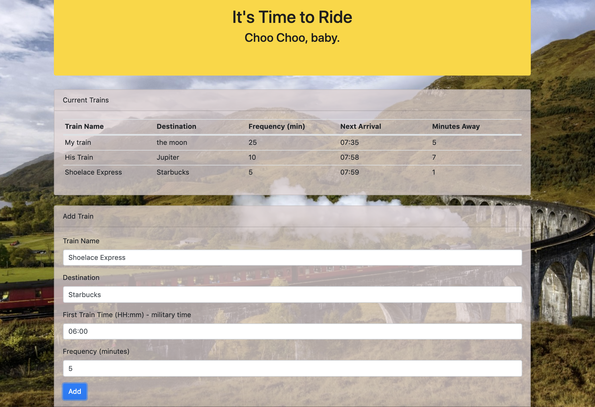

# Choo-Choo-Time

Live link: https://ltcondon.github.io/Choo-Choo-Time/

# Summary

Choo Choo Time is a train schedule app that allows a user to add a train name, destination, frequency, and first train time to be displayed on the schedule board. The app then calculates when the next train will arrive, and displays how many minutes away the next arrival is.

## Technology

The app was built using HTML, CSS, Bootstrap, Javascript, jQuery, moment.JS, and uses Google's Firebase as a way to store and retrieve user data.

## Current State

At the time of writing, the train schedule works as explained above, but does not yet posess the functionality to show updated train times.

## License
[MIT](https://choosealicense.com/licenses/mit/)